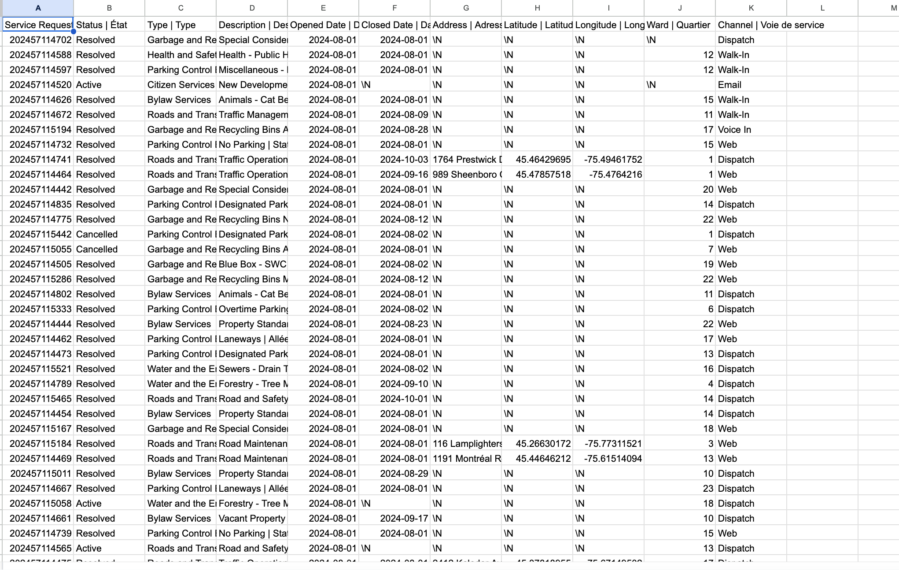
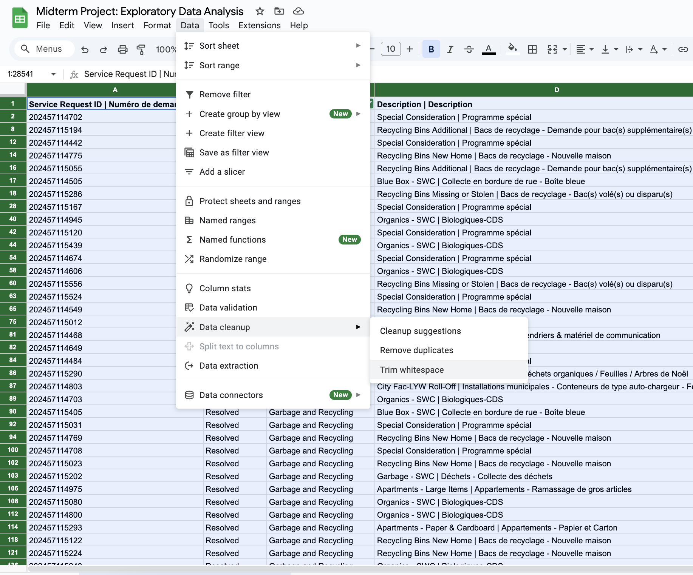
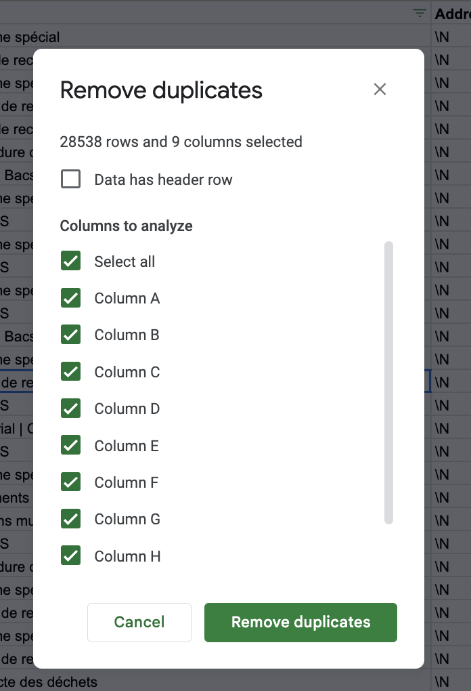
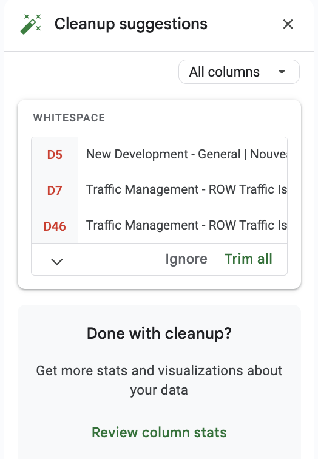
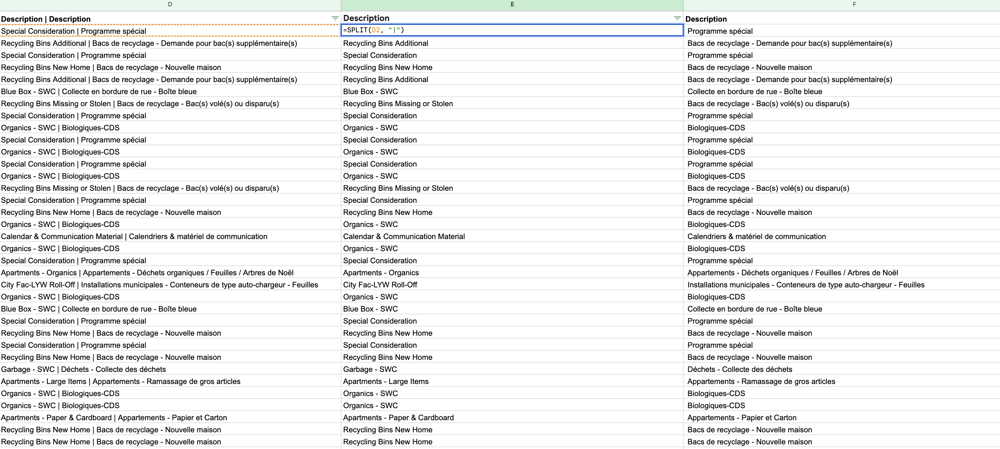
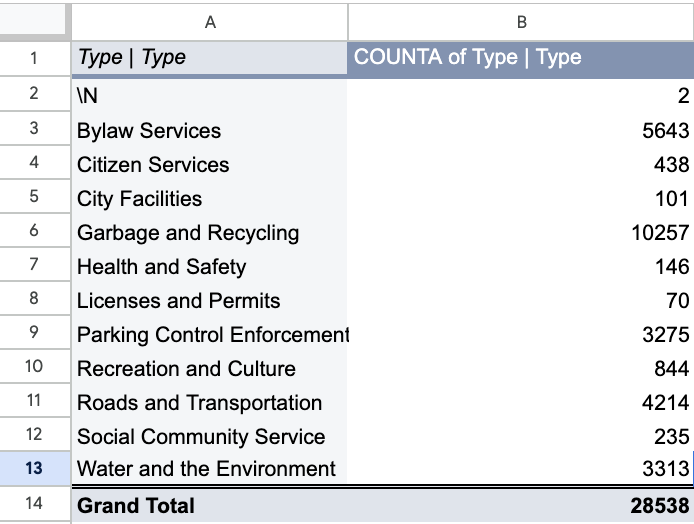
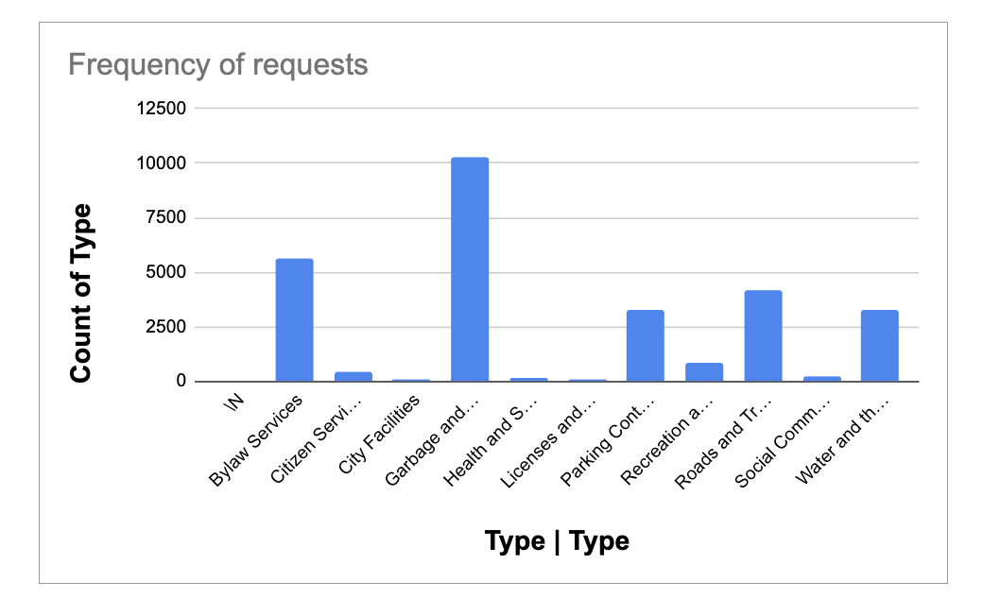
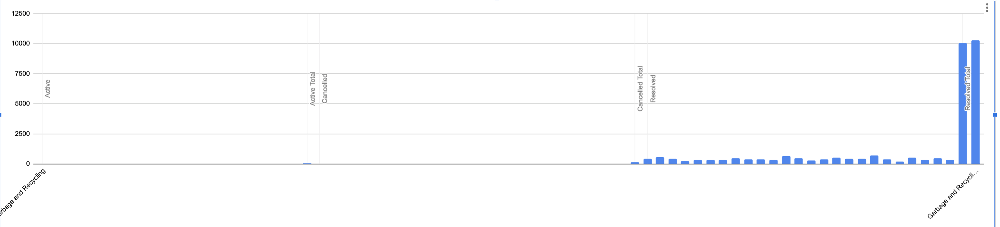

**November 4 2024** 
**MPAD2003 Introductory Data Storytelling** 
**Sarah Hussein** 
**Presented to Jean-Sébastien Marier** 

# Midterm Project: Exploratory Data Analysis (EDA)

Use one hashtag symbol (`#`) to create a level 1 heading like this one.

## Foreword

For this assignment, you must extract data from a dataset provided by the instructor. You must then clean and analyze the data, create exploratory charts/visualizations, and find a potential story idea. Your assignment must clearly detail your process. You are expected to write about 1500-2000 words, and to include several screen captures showing the different steps you went through. Your assignment must be written with the Markdown format and submitted on GitHub Classroom.

I have been assigning different versions of this project to my digital journalism and data storytelling students for a few years now. Its structure was inspired by the main sections/chapters of [*The Data Journalism Handbook*](https://datajournalism.com/read/handbook/one/). This version was further inspired by the [Key Capabilities in Data Science](https://extendedlearning.ubc.ca/programs/key-capabilities-data-science) program offered by the University of British Columbia (UBC).

**Here are some useful resources for this assignment:**

* [GitHub's *Basic writing and formatting syntax* page](https://docs.github.com/en/get-started/writing-on-github/getting-started-with-writing-and-formatting-on-github/basic-writing-and-formatting-syntax)
* [The template repository for this assignment in case you delete something by mistake](https://github.com/jsmarier/jou4100_jou4500_mpad2003_project2_template)

Did you notice how to create a hyperlink? In Markdown, we put the clickable text between square brackets and the actual URL between parentheses.

And to create an unordered list, we simply put a star (`*`) before each item.

## 1. Introduction

This assignment focuses on the City of Ottawa dataset which provided a large scope of services that are being offered primarily the municipal service requests which is offered on their [website](https://open.ottawa.ca/documents/65fe42e2502d442b8a774fd3d954cac5/about).
This specific dataset for the purpose of this assignment through [github]( https://raw.githubusercontent.com/jsmarier/course-datasets/refs/heads/main/ottawa-311-service-requests-august-2024.csv) providing insight to the types of services the residents of Ottawa are engaged in and it primarily highlights how the municipal recourses are allocated and the distributed overall. The information collected shows how citizens make service requests, that details the nature of the issues and the status of the resolution. Upon initial examination, the dataset is comprised of diverse service categories that include Garbage and Recycling, Parking Control Enforcement, and Bylaw Services. We can gather based on the frequency of service requests, the patterns of municipal concerns throughout the community which enables a better understanding of city infrastructure and most importantly the resident needs.

## 2. Getting Data

### Importing the Data into Google Sheets

To import the City of Ottawa service request dataset into google sheets, I first accessed the data link via Brightspace. By right clicking the link opened up a new page, and from there I clicked on the "file" tab. I proceeded to saved the data as a csv file. In Google Sheets, I clicked on file >  and then "import" and uploaded the CSV, successfully adding it to my existing sheet. Below is a screen capture showing the first few rows and columns of the dataset. 

 

### Observations

The dataset contains 11 columns and 28,538 rows. In the truthful art Cairo (2016) states “a visualization is any kind of visual representation of information designed to enable communication, analysis, discovery, exploration”. The visual observation gathered shows a variety of service request with details such as the type, description, and opened: closed dates. Generally, the data appears roughly presentable however, there are some entries with missing values in address fields, which may impact viewers understanding. Moreover, the spacing of the columns in addition to some specific entries may denote a further need of clean up for spacing and validity of the data. Further inspecting the columns, there are some specific observations that can be seen. 

*Column B shows a specific “Status” for each service ID number in Column A. They are nominal variables, denoted by their respective category (e.g., Resolved, Active, Cancelled).

*Column G is represented to show the address. Here the information gathered is either denoted by “/N” which means not applicable, or some addresses provided is shown. Two things might be deduced based off of this; suggesting either there are privacy concerns or there might be incomplete submissions.

*Column H and I  shows coordinate data for longitude/ latitude of the respective location. The data is shown for the locations with a specific address that is shown however the ones that don’t have an address can be seen denoted by “/N”.

Looking overall at the data gathered I further analysed that with respect to missing data, it reflects on The City of Ottawa’s mission to upholding the wishes/concerns of its citizens that chose to not share their location for privacy reason. Additionally, the data shows corresponding information with respect to [Wards](https://ottawa.ca/en/city-hall/elections/ward-maps-and-school-board-zones#section-9ac4699c-ed4f-4179-b386-78953e3ab0d0) and upon further research, they are denoted numerically by their corresponding zone number from 1-24. 

This assignment can hypothesise that for wards with a higher population density and greater commercial activity could experience more frequent garbage service requests.

## 3. Understanding Data

### 3.1. VIMO Analysis

Cairo (2016) concurs that with respect to data “Data always vary randomly because the object of our inquiries, nature itself, is also random”.  That can be observed when looking at the variety of information provided by The City of Ottawa dataset, however, by applying a filter on specifically on garbage and recycling, a more concise deduction can be made. 
Analyzing garbage and recycling service request data reveals some intriguing insights!  . By creating a pivot table primarily to observe Garbage and Recycling Ward 19 stands out with a staggering 627 resolved requests, indicating the possibility of a high population density or significant commercial activity showing the validity of the data. Invalid entries don’t fall under this specific column filter as they seemed to be appropriately allocated with their respective statuses. Address data is notably missing in many entries, affecting the ability to analyze the geographical distribution of service requests, which would require a further research based only on the Ward. Outlier values could be seen with the by difference in request numbers from wards with a fewer population and the converse can be seen for wards with a higher population.

### 3.2. Cleaning Data
Following the tutorial taught in class, I initially started by making the column appear well adjusted by selected all the cells and then double clicking the column on the side so it can equally space out. Additionally the steps below further enhance the quality of my dataset.
1. Clearing white spaces: in google sheets the data can be easily cleaned up by clicking on ‘Data>Data cleanup> Trim white spaces’. This helps remove any spaces that might be a hindrance when analysing data. 
2. Removing duplicates : To ensure that each service request was unique, I checked for and removed any duplicate entries. This was done by highlighting the data range by clicking on the column, then clicking on ‘Data > Data cleanup > Remove duplicates’. 
3. By deleting unnecessary columns: like date opened and date closed in addition to channel, helped make the data more clearly presented. This allows for a clearer view of the essential information, such as the service request IDs, status, types, and descriptions; helping eliminate clutter and made the remaining data more relevant and focused.Google sheets also suggested some things with regards to cleaning up data which I also applied. 
4. Using the split function: This function in Google Sheets helped significantly enhanced the organization of my dataset by allowing me to separate the descriptions into their respective languages, English and French. This is especially useful in datasets where bilingual information is provided in a single column, which make it challenging to analyze or filter data effectively. The formula used is `=SPLIT(D2, "|")’ `  and can be seen here .

### 3.3. Exploratory Data Analysis (EDA)

According to statcan (2021) “Once data has been obtained, either from this series of steps or from an administrative or alternative source of information, it’s time to process it so it’s ready to be used to produce statistical information”. For this assignment I created two pivot tables that helped further hone in the dataset. 

### Pivot Table 1: Total Service Requests by Type 
This helped gauge and provide a comprehensive overview of the total service requests categorized by type, which helps gauge the demand for various municipal services. From that I deduced how the garbage and recycling department had the most request amount with 10,257 requests. This was then followed by bylaw services: which was the second most requested service. This comparison can highlight which services are most frequently requested and might inform resource allocation. The remaining service types, such as Health and Safety and Roads and Transportation, show lower request counts, but still highlight areas of community engagement and need.     

### Pivot Table 2: Garbage and Recycling by ward
This pivot table summarizes the number of active garbage collection requests per ward. Which was the key takeaway for the hypothesis. While the data for location may have not been accessible the wards can be further analysed as provided by the website the City of Ottawa provides a clear distinction for each and that can be further analysed. Specific wards with significantly higher numbers of active requests, indicate areas with potentially higher population density or service needs.  This chart illustrates garbage and recycling requests segmented into active, resolved, and cancelled categories. The Resolved segment are highly populated in the chart which demonstrates effective service management, from the city of Ottawa.
I chose to focus on the wards and garbage recycling because they reveal patterns in community needs and service demands. Analyzing these variables helps identify the areas that would require more resources from a preventative perspective.

## 4. Potential Story

The data I specifically focused on: garbage and recycling request, offers a compelling story about how the community needs can be supported and made better by the municipal government branches. By analyzing the service requests across different wards, a clear pattern can be seen: certain areas are experiencing significantly higher demand for waste management. The pivot tables and charts reveal that garbage and recycling services account for over 10,000 requests, far exceeding those for other services like bylaw enforcement or recreational activities.
While the data might be relatively higher than other branches it shows how crucial it is that effective waste management plays in our daily lives and needs to be supported by the citizens. Interviewing waste management supervisors or city planners could provide insights into how services are allocated and challenges they face in meeting community demands. The turnover rate for majority of requests reflects the ongoing initiative from the city of Ottawa with respect to the requests made. Successfully addressing these demands, with very few cancelled requests, speaks to the efficiency of the service. By further researching official reports on waste management services can help provide a more well-rounded approach to supporting the hypothesis and can help show current practices and future plans. The analysis shows just how important garbage and recycling services are and also opens up opportunities for improvements.

## 5. Conclusion

Insert text here.

## 6. References

Include a list of your references here. Please follow [APA guidelines for references](https://apastyle.apa.org/style-grammar-guidelines/references). Hanging paragraphs aren't required though.

**Here's an example:**

Bounegru, L., & Gray, J. (Eds.). (2021). *The Data Journalism Handbook 2: Towards A Critical Data Practice*. Amsterdam University Press. [https://ocul-crl.primo.exlibrisgroup.com/permalink/01OCUL_CRL/hgdufh/alma991022890087305153](https://ocul-crl.primo.exlibrisgroup.com/permalink/01OCUL_CRL/hgdufh/alma991022890087305153)
